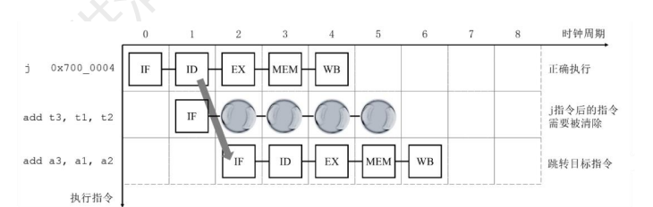
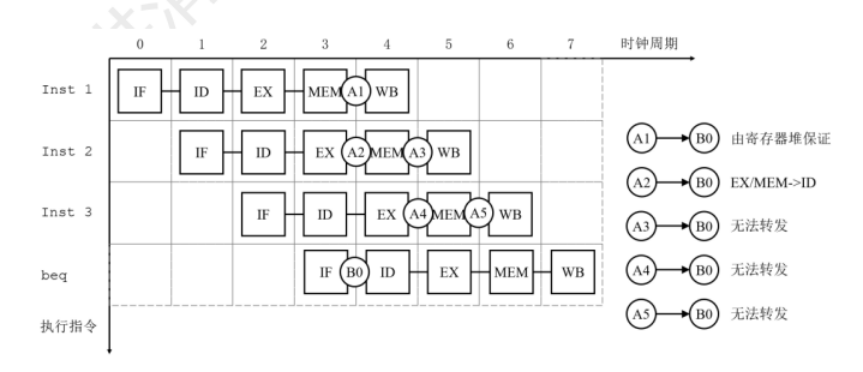
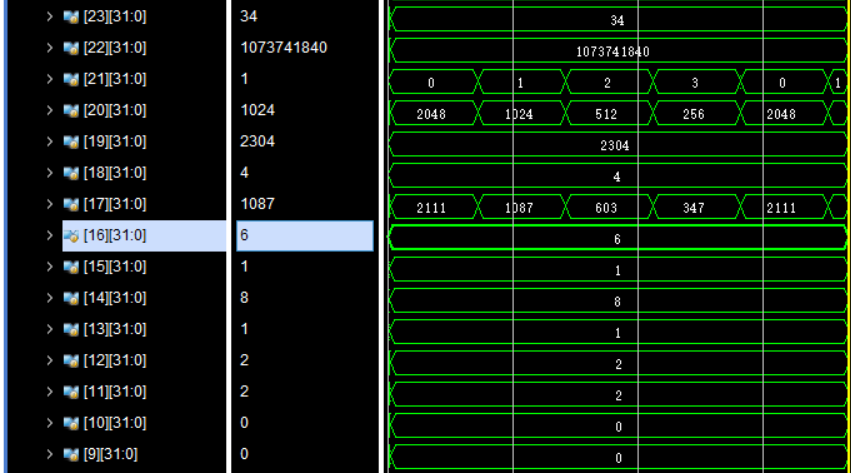
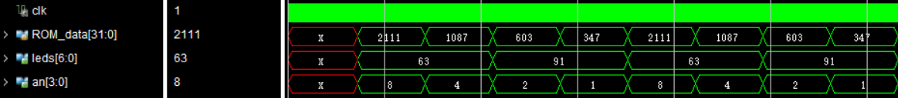
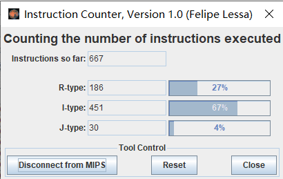
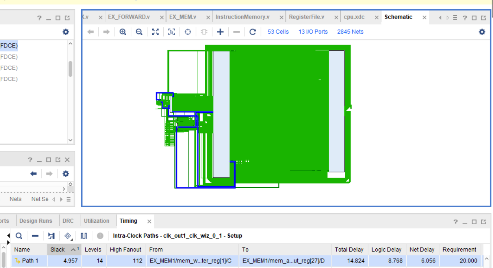
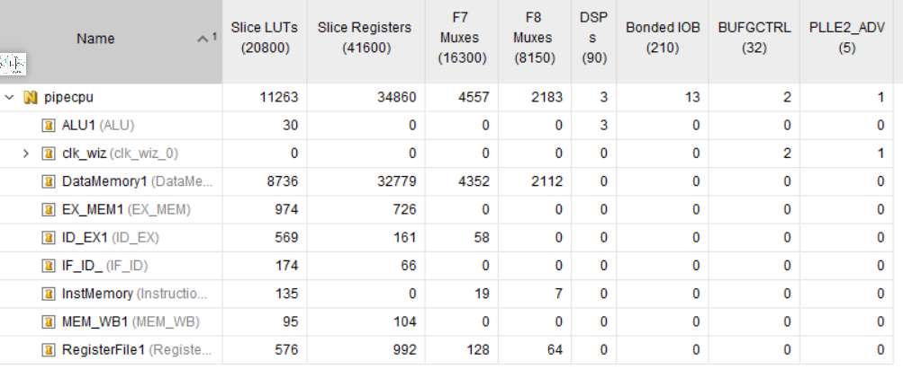
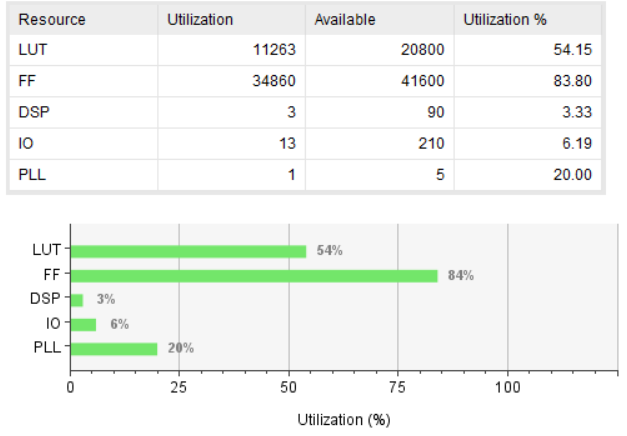
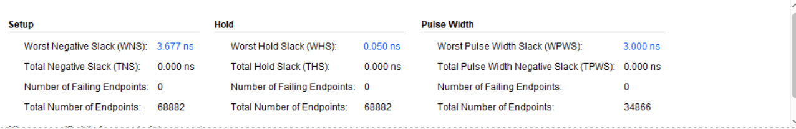
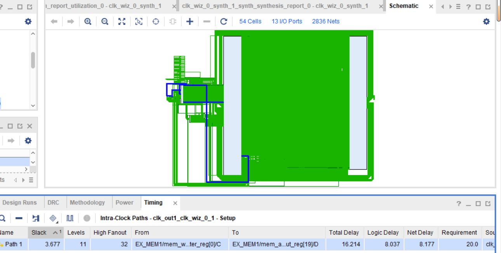

# 流水线处理器大作业

吕靖（无14 2021012721  lv-j21@mails.tsinghua.edu.cn）


## 实验目的
- 将理论课处理器大作业中设计的单周期MIPS 处理器改进为流水线结构，并利用此处理器完成最短路径算法
- 通过实验更深层次地理解流水线处理器的结构以及数据通路的设计，并对数据和结构冒险的处理有更深的理解和掌握。

## 结构设计
### 五级流水线
将指令的执行阶段分成五个阶段（五级流水线），分别是IF,ID,EX,MEM,WB：
- **IF**:取指令阶段。根据PC的值读取指令寄存器中的指令，并更新PC
- **ID**:译码阶段。根据指令的数据翻译出后续需要的控制信号，读写寄存器的地址以及计算用的立即数信号，并更具需要读出寄存器。
- **EX**:计算阶段。根据操作码的要求，对立即数或者读出的数据进行计算
- **MEM**:访存阶段。可以将EX阶段得到的结果写入内存，也可以将计算所得的地址读取内存的数据。
- **WB**:将计算结果或者读取的数据写入寄存器堆

在具体的设计中，每一阶段所担任的功能将在上述基础上有所扩展，方便处理冲突和提高效率。同时，由于流水线本身的结构限制，需要在每两个阶段间增加一些寄存器来保存下一个阶段需要的控制信号和信息，在代码中我将其命名为：IF_ID,ID_EX_EX_MEM_MEM_WB,相关阶段的变量也都有类似的前缀，方便区分繁多的控制信号。
#### 数据冒险：
为了解决Read After Write问题带来的效率下降，采用转发的方式解决，转发的数据源有两个：计算指令的结果和lw指令读取的内存中的值，由于当前执行的指令最多依赖前两条指令（在往前已经写入寄存器，无需转发），所以共有四个数据来源。在下图中表示为A1,A2,A3,A4,而需要使用这些数据的地方有两个：计算所需要的数据、sw的值，对应于图中的B1,B2环节，在wb前并不需要转发，因为wb环节要写入的数据来源无非是pc+4（jal指令）、计算所得的数据，还有从mem中读出的数据（上一条指令要写入这块内存还没写完），但是这些情况完全被B1,B2涵盖，所以考虑这4*2条转发通路即可。


为了方便，A1->B1的通路完全可以由A2->B1代劳，所以通篇考虑，只需要三条转发，分别是：
A2->B1,A3->B1,A4->B2,还有一条A4->B1是无法转发，必须阻塞的。于是，我们对这几种情况进行讨论：

- **发送到当前指令的EX阶段**
  即当前指令的ex阶段需要使用！主要是A2和A3，lw的值和ex的炯酸结果。当前有两条判断标准：
  - 转发源（前面两条指令）需要写入寄存器，即reg_write控制信号为1且目标寄存器ID不为0.
  - 当前指令的目标写入寄存器和转发源写入目标寄存器相同。
  在此基础上，当A2,A3同时转发时，EX_MEM的转发优先级更高，优先判断即可：在代码中可以表示为
```c
 always@(*)begin
    if(mem_regwrite && mem_write_register!=0&& mem_write_register==ex_rs )
    ex_forward1 = 2'b10;
    else if(wb_regwrite &&  wb_write_register!=0&&wb_write_register==ex_rs &&
     (mem_write_register !=ex_rs || mem_regwrite!=1))
    ex_forward1 = 2'b01;
    else
    ex_forward1 = 2'b00;
    
    if(mem_regwrite && mem_write_register!=0&&mem_write_register == ex_rt)
    ex_forward2 = 2'b10;
    else if(wb_regwrite && wb_write_register!=0 &&wb_write_register == ex_rt&&
    (mem_write_register !=ex_rt ||mem_regwrite !=1))
    ex_forward2 = 2'b01;
    else
    ex_forward2 = 2'b00;
    end
```
由于转发有两条通路（寄存器读取时rt，rs均有可能），所以两个id_forward变量。对应的有两条databus，一条连接在从寄存器堆rs通路，一条连接在立即数和rd的通路（这一点可以在后面的通路图中看到）。首先对mem阶段判定，即优先考虑了A3的数据转发，其次考虑A2，基本判定条件相同，不过为了保险，在后面加上了排除A2的语句，当然事实上经过测试完全可以不加。

- **load use冲突的处理**
  上述转发方案解决了部分数据冲突，但因为A4->B1无法通过转发解决，A4是lw指令，必须通过阻塞实现，load use的判定条件：
  - EX阶段要读取memory
  - ID阶段要读取寄存器，且读取的寄存器和EX写入寄存器相同。
  此情况的代码为：
```c
if(ex_memread && (ex_write_register==id_rs||ex_write_register==id_rt))
        stall = 1;
```
同时，对于A4->B2的转发，由于设计的寄存器读取在ID阶段完成，对于lw+sw的指令组合，我们可以发现，在上面stall的条件下，lw指令已经阻塞了一个周期，假设加入转发通路，对于上述stall的判定需要增加其他约束，所以不妨直接考虑将它也视为load use冲突，因为通过阻塞后，这种情况就会退化为A2->B1了，然后直接使用EX的转发通路就会很容易。至此数据冒险就可以解决了，这会损失一定的效率，但是对于设计来说更加简洁。

注意到上述stall只采用了一位，按理说采用五位来表示五个阶段分别是否需要阻塞更合理，这是因为我将分支跳转的判断同样放置在ID阶段，一旦判断出需要阻塞，只需要在IF_id和ID_EX寄存器保持原值即可。阻塞后将在下一周期重新检测转发条件，从而在下一周期进行转发解决冲突。后续阻塞的处理也类似。

#### **控制冒险**
我们还需要解决控制冒险，主要体现在跳转和分支指令：
- **j跳转指令**：
  j指令跳转的地址在ID阶段计算得到，但是此时IF_PC已经加4，阻塞只能延缓而不能使pc跳转，解决方案是将j指令后的PC+4这条指令直接flush，并重新设置pc。这些操作需要在ID阶段完成


    代码可以表示为：
    ```c
    assign if_flush =( ~stall&&id_pcsrc != 2'b00)?1:0;
    ```
    上述代码中pcsrc不是0时，表明为跳转指令（不止j，还有jal，等），flush信号为1时，**在IF_ID阶段将ID的寄存器和清零即可达到清除作用**。同时当stall和flush同时出现时，必然要先执行stall，stall后再清除，所以加上```~stall```的判断。需要注意的是，这里并没有办法对jr和jalr指令做出很好的超前判断，因为他们需要读取寄存器的值，这里没有额外的转发电路，这一问题将在下面得到解决。
- **分支指令**：
  同样地可以采用直接清除的策略，但是这样会固定地损失三个时钟周期，因为最终地址在EX计算后才能判断是否跳转。在设计中为了能够提高运行效率，可以在ID阶段额外增加电路进行提前判断，这样的代价是又会引入新的数据冒险，以beq为例，
  

  在上述转发中，显然需要转发到ID阶段，这就使得条件很苛刻，能实现的只有A1->B0和A2->B0，对第一条，写入寄存器和读取寄存器时同时进行的，我们需要在寄存器堆中增添语句：
  ```c
    assign Read_data1 = (Read_register1 == 5'b00000)? 32'h00000000:
                        (Read_register1==Write_register&&RegWrite)? Write_data:
                        RF_data[Read_register1];
    assign Read_data2 = (Read_register2 == 5'b00000)? 32'h00000000:
                        (Read_register2==Write_register&&RegWrite)? Write_data:
                        RF_data[Read_register2];
        
  ```
    通过这条语句就能解决第一个转发，即解决了同时读写的冲突。对于第二个A2->B0,我们需要额外的路径转发到ID。转发针对于branch指令，判断条件是：
    - 是branch指令，即branch信号为1
    - 转发源regwrite信号为1且待写入寄存器branch指令中目标寄存器相同（不为0）
  
    从而，可以完善stall相关代码：
    ```c
    always@(*)begin
    if(mem_regwrite&& (id_branch==1||id_pcsrc[1]==1)&&
        mem_write_register!=0 && mem_write_register == id_rs)
        id_forward1 =1'b1;
    else 
        id_forward1 = 0;
        
    if(mem_regwrite &&(id_branch==1 || id_pcsrc[1]==1) &&
        mem_write_register!=0 &&mem_write_register == id_rt)
        id_forward2 = 1'b1;
    else
        id_forward2 = 0;
    end
    ```
    注意到我们在代码中增加了```id_pcsrc```的判断，```pcsrc[1]==1```表明它是jr或者jalr指令，相比于branch指令，jr和jalr同样需要到ID的转发路径，但是好处是他们不需要像branch指令一样增加额外的比较电路，因为读到的值就是pc。

    进一步，上图中显然还有很多无法实现的转发，只能使用阻塞来实现：
    ```c
    always@(*)begin
        if(ex_memread && (ex_write_register==id_rs||ex_write_register==id_rt))
            stall = 1;
        else if(ex_regwrite&& (id_branch==1||id_pcsrc[1]==1)&&
            (ex_write_register==id_rs||ex_write_register==id_rt))
            stall = 1;
        else if((id_branch==1||id_pcsrc[1]==1)&&mem_memread&&
            (mem_write_register==id_rs||mem_write_register==id_rt)) 
        stall=1;
        else
        stall=0;
      end
    ```
    上述代码第一条是在解决**数据冒险**时load use时的判断条件，现在增加新的判断条件，第二条对应于A4,即计算指令的结果需要在ID阶段使用。第三条对应于A3，即lw的结果需要使用。对于A5的情况，可以确定inst3是lw指令，我们不需要对它进行额外的stall判断，因为在它运行到EX阶段会生成阻塞stall=1，其后MEM阶段仍然会形成阻塞，故而恰好满足阻塞时长两个周期，不需要额外引入阻塞条件，思路很类似于数据冒险中A4->B2。

    与j型指令一样，由于在ID阶段pc默认为pc+4，当需要跳转时我们同样需要将它flush掉，于是flush信号的判定完善为：
    ```c
    assign if_flush =(~stall&&id_branch && id_zero || id_pcsrc != 2'b00)?1:0;
    ```
    flush的操作就是在IF_ID阶段直接全置0即可。
    从而我们就可以得到完整的关于pc的控制冒险的解决：
    ```c
    assign id_pc_branch = (id_zero&&id_branch)?(id_pc_plus4 + signExt*4):if_pc_plus4;
        
    assign id_pc_jump = {id_pc_plus4[31:28], id_instruction[25:0], 2'b00};
        
    assign pc_next = (~if_flush&&(stall||reset))?pc:
                     (id_pcsrc == 2'b00)? id_pc_branch:
                     (id_pcsrc == 2'b01)? id_pc_jump: id_databus1;
    always @(posedge reset or posedge clk)
            if (reset)
                pc <= 32'h00400000;
            else
                pc <= pc_next;
    ```
    这样就可以解决跳转和分支的问题！(zero信号就是我们需要增加的比较电路，这里不再细说明)

至此，冒险解决。接下来介绍各个环节的操作。


部分变量的保存时效：

#### IF：
```c
InstructionMemory InstMemory(pc, Instruction);
```
在设计中数据存储和指令存储分开，在上述模块中依据当前的pc将指令取出。
#### IF_ID及ID操作
ID阶段是译码环节，首先需要读取指令中的信息：
输入信号中有stall和if_flush信号，如果stall，就保持寄存器的值不变，如果flush，直接清零即可。

通过读出的各部分信息，然后生成控制信号：
```c
Control Control1(.OpCode(id_opcode),.Funct(id_funct),
                               .PCSrc(id_pcsrc),.Branch(id_branch),
                               .RegWrite(id_regwrite),.RegDst(id_regdst),
                               .MemRead(id_memread),.MemWrite(id_memwrite),
                               .MemtoReg(id_mem2reg),.ALUSrc1(id_alusrc1),
                               .ALUSrc2(id_alusrc2),.ExtOp(id_extop),
                               .LuOp(id_luop),.ALUOp(id_aluop));

 ALUControl ALUControl1(.ALUOp(id_aluop),.Funct(id_funct),.ALUCtl(id_aluctrl),.Sign(id_sign));
```
需要说明的是，在控制信号模块```Control```中，在单周期大作业的基础上，增加了分支指令（beq、bne、blez、bgtz、bltz）和跳转指令(j、jal、jr、jalr)，同时算法需要，增加了乘法mul指令，扩充了指令集。在这里我将alu需要的控制信号一并得到，（当然写在哪里并不重要，只要输入输出信号正确，可以写在任何地方，但是写在对应阶段里面逻辑会更清楚。）

同时，我们还需要读取寄存器和立即数：
```c
 RegisterFile RegisterFile1(.reset(reset),.clk(clk),
                                    .RegWrite(wb_regwrite),
                                    .Read_register1(id_rs),
                                    .Read_register2(id_rt),
                                    .Write_register(wb_write_register),
                                    .Write_data(wb_databus3),
                                    .Read_data1(id_databus1_tmp),
                                    .Read_data2(id_databus2_tmp));
```
可以看到，由于寄存器模块在WB阶段和ID都使用了，所以这里读寄存器时的两条通路使用id前缀，写寄存器时的数据用wb前缀，便于区分。同时在读寄存器后还有_tmp后缀，表明它不一定是最终进入alu的data，有可能需要接受后续模块的转发。
```c
wire[15:0] id_imm;
assign id_imm = id_instruction[15:0];//立即数的是礼物诶
wire[31:0] id_imm_ext1;
assign id_imm_ext1 = {id_extop?{16{id_imm[15]}}:16'h0000,id_imm};
wire[31:0] id_imm_ext2;
assign id_imm_ext2 = id_luop?{id_imm,16'h0000}:id_imm_ext1;


Zero zero(.id_databus1(id_databus1),.id_databus2(id_databus2),
                    .id_opcode(id_opcode),.id_zero(id_zero));

```
在上述代码中，我们对可能的立即数做了处理，```id_imm_ext2```是最终扩展结果，luop信号主要针对于```lui```指令，是将低16位置零，高位为输入的立即数，其他情况下，extop=1是有符号扩展，反之为无符号扩展。同时，跳转指令j,jal与jr,jalr在控制信号pcsrc中已经作了区分；对于分支指令，需要两个信号zero和branch同时为1，对于zero的计算我另外设计了一个模块```Zero```,在zero模块中除了对beq等基础的分支指令做了处理，对于增加的bne,blez等也做了处理
```c
always@(*)
          case (id_opcode)
              6'b000100:id_zero <= (id_databus1 - id_databus2 == 0)?1:0;//beq
              6'b000101:id_zero <= (id_databus1 - id_databus2 == 0)?0:1;//bne
              6'b000110:id_zero <= (id_databus1 ==0 || id_databus1[31]<0);//blez
              6'b000111:id_zero <= ~id_databus1[31];//bgtz
              6'b000001:id_zero <= id_databus1[31];//bltz
              default :id_zero <= 0;
          endcase
```
对于PC的处理我也放在ID中，代码已经在处理冲突时说明，这里不再展示。

#### EX
主要执行计算：
```c
assign ex_databus1 = (ex_forward1==2'b01)? wb_databus3:
                    (ex_forward1==2'b10)?mem_alu_out:ex_databus1_tmp;      
assign ex_databus2 = (ex_forward2==2'b01)? wb_databus3:
                    (ex_forward2==2'b10)?mem_alu_out:ex_databus2_tmp;

assign ex_aludata2 = (ex_alusrc2)?ex_imm_ext2:ex_databus2;
assign ex_aludata1 = (ex_alusrc1)?{27'h00000,ex_shamt}:ex_databus1;
```
判断是否是转发数据，是否是立即数数据等，接着送入计算单元alu进行下一步计算：
```c
ALU ALU1(.in1(ex_aludata1),.in2(ex_aludata2),.ALUCtl(ex_aluctrl),
        .Sign(ex_sign),.out(ex_alu_out_tmp),.zero(ex_zero));

assign ex_alu_out = (ex_mem2reg[1]==0)?ex_alu_out_tmp:ex_pc_plus4;
```
这里对于jal指令做了补充，因为```ex_alu_out```是需要往后继续传递的量，当```ex_mem2reg[1]!=0```，说明需要存储的是jal的吓一跳指令地址，即pc+4.
#### MEM
主要执行sw指令，并作为中继传递一些WB环节的值。
#### WB
同样，我们需要考虑写入寄存器的数据来源，
```c
assign  wb_databus3 = (wb_mem2reg ==2'b01)?wb_read_data:
                    ( wb_mem2reg == 2'b00)?wb_alu_out:wb_pc_plus4;
```
当```wb_mem2reg==2'b01```,说明是lw指令，需要写入读出来的值，为0说明需要写入计算结果，其他情况就是jal指令，写入pc+4.

总体设计：


数据结构是哈弗结构，指令存储和数据存储分开，为了方便观察，部分信号的名称没有详细标注。

### 文件清单：
- pipecpu.v：cpu主文件
  - InstMemory.v：指令存储
  - IF_ID.v：IF到ID的级间寄存器
  - Conrtol.v：生成控制信号
  - ALUControl.v：生成ALU的控制信号，控制ALU的具体操作
  - RegisterFile.v：寄存器堆
  - Zero.v：生成zero信号，具体针对于各类branch指令
  - EX_MEM.v：EX和MEM级间寄存器
  - DataMemory.v：数据存储
  - MEM_WB.v：MEM和WB的级间寄存器
  - EX_FORWARD.v：向EX阶段的转发判断
  - ID_FORWARD.v：向ID阶段的转发判断
  - HAZARD.v：阻塞的判断
- cpu.xdc:管脚约束文件
- testcpu.v:simulation文件，其下有完整的pipecpu。
- dijkstra.asm：汇编算法文件

## 仿真结果及分析
本次实验需要运行最短路径算法，采用汇编大作业中的数据，算法使用dijkstra算法，预期计算得到的到各个点的距离为8，3，5，10，8，和为34，在十六进制中表示为```0x0022```,这也是需要在硬件FPGA上显示的值。

在一般的dijkstra算法后，加入了软件编码，同时写入```0x00400010```的内存地址，这一地址我在memory中额外增加了一个量，便于调试观察。


运行一段时间后，我们观察内存，其中RAM[513:517]是记录distance的地址，可以看到内存中的值是8,3,5,10,8，结果正确。


接着我们观察寄存器的值，可以看到23号寄存器的值时34，即距离总和，接着我将需要显示的各位数字计算并写入9,10,11,12号寄存器，分别是0,0,2,2，同样符合预期，在这之后程序将一直循环译码，循环写入存储地址```0x00400010```，FPGA的显示也直接由写入的值决定。为了防止显示的刷新率过高导致数码管全亮，我设置了5000的空循环来延时，效果如下：


可以看到，在我设置的ROM_data中的量是循环变化的，leds信号和an的变化同样符合预期，通过simulation上方的时间刻度，大致看出FPGA的数码管大约0.5ms刷新一次，可以完成轮播。

接着我们计算相关数据：


在vivado中，我们执行到计算出结果后停止：在9600ns，执行完毕，每个周期10ns，总共960个周期，则```CPI=960/667=1.44```。

## 综合及实现情况
### Synthesis
在约束文件中设置时钟周期为10ns，在pipecpu.v文件中分频为50MHZ，观察这个参数下的情况：

可以看到，在50MHZ情况下可以正常工作，WNS=4.957ns,我在XILINX官方找到的计算最大频率的方法为：

从而可以得到最大频率为```1/(20-4.957)*10^9=66.5MHZ```

最长延时是14.824ns，观察到关键路径包含数据寄存器，转发和冒险判断，时钟频率也在很大程度上受其所限制。

接着我们观察资源占用：


可以看到，流水线处理器占用的资源还是相当大的。
## Implementation


可以预见的在实现之后时序性能会有下降，WNS仅有3.677ns,关键路径的延时达到了16.214ns,计算所得的最高频率为61.3MHZ，可见我设计的cpu性能还是不太理想。

按照implementation的结果，时钟频率为61.3MHZ,CPI=1.44，故每秒可执行指令```61.3/1.44=42.57M```条指令
资源：


资源消耗相比于单周期和多周期也更多。

## 软硬件调试

在写处理器的过程中，我遇到了很多bug，印象深刻的是在某些赋值语句中，阻塞赋值和非阻塞赋值可能对代码正确性带来极大影响，同时在关于ID提前判断分支时的判断电路中，对于每一条指令我刚开始都额外增加了计算单元，但是在增加了电路负荷的同时，还会出现有符号、无符号数的混淆，比如在bltz中一个负数减一个整数是小于0，但是会被识别为无符号数，即一个很大的正数，在调试过程中这个潜藏的bug也困扰了我许久，最终方案是直接判断首位即可。还有很多问题出在control信号，当时我的cpu在跑汇编程序时总会在某一环节pc变为0，我检查了汇编程序中用到的每一条指令，都是正确的，通过跟踪程序运行，我发现问题出在一个这段程序并没有使用到的指令jalr上，由于在写control文件中忘记了一个括号，导致在程序运行到那一条指令时，由于立即数恰好和jalr的funct一致，就将指令解释为jalr，从而指令跳转出去，变成了默认的0。之前还出现过stall和flush同时为1的情况（按照代码stall=0是flush为1的条件），最终发现同样是由于pcsrc控制信号有误。类似的问题在大作业过程中还有很多，困扰了我很长时间。

在硬件调试方面进行的比较顺利，写好xdc文件后上板就直接显示出了数值，没有花费太长时间。

## 思想体会
编写流水线cpu是十分富有挑战的的工程，由于理论课讲解的流水线cpu是较宏观的，很多细节没有涉及，比如转发，阻塞等，所以在设计处理冒险的部分时我很大程度上参考了理论课配备的教科书，

在设计时，我先没有考虑任何冒险，按照一般意义上的五级流水线写出基础流程，然后，针对转发，阻塞，清除做了大量工作，参考了很多资料，我设计的cpu效率不高，一方面是我在设计时为了编程的方便没有做更多的冒险处理，比如lw+sw的mem转发，我直接用阻塞+另一条通道的转发代替，简洁了代码但是降低了效率。即使如此，想要完整地不出错的写好cpu仍然是艰辛的，因为这个工程中能出错的地方太多了，可能自己的cpu某处的逻辑缺少了一个控制信号，可能某个寄存器赋值出问题，可能在录入初始数据的时候出错了，可能汇编程序有问题，可能在录入机器指令的时候出错了，或者即使代码逻辑正确，但是电路实现却有问题，为了解决这些问题我花费了非常大的精力和时间，也正是在这个过程中，我更深入地了解了流水线处理器的设计细节，了解到了相比于理论课更具有实操意义的细节处理。

同时本次实验，我进一步理解了模块化设计的好处，更好地掌握了verlog语言的用法，对硬件电路的理解也更深了，虽然vivado的debug比其他编程语言更繁琐，但经过长时间的探索，我也初步理解了硬件debug的方法，整个过程异常艰辛，长时间熬夜最后可能发现只是一个符号的问题。所以最终FPGA烧录成功，出现的0022的时候，我非常激动，感受到了极大的满足。


  